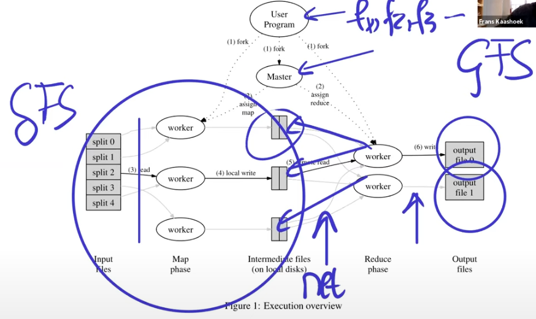

# Memo

## 処理の流れ

GFSによって分割されたデータが複数台のワーカーマシンに保存されている。そのマシン上で保存されているデータに対してMap関数が実行され（つまり同一マシン上でGFSとMap関数の両方が動く）、出力された中間データはローカルディスクに保存される。よって中間データが保存されるまでの間はMapReduceではネットワーク通信は発生しない。

マシン上では中間データはkeyごとに保存される。*それぞれのキーごとにReduce関数が割り当てられて実行される。Reduce関数は各マシンから自身に割り当てられたキーの中間データをネットワーク通信を介して集めてきて処理を行う。最終的な出力データはGFSに保存される。

## Straggler

MapReduceではタスク全体が完了するまで待つ必要がある。もし一部のタスクがハードディスクの故障などで遅延している場合、全体の処理が遅くなってしまう。このような遅延を引き起こすタスクをStragglerと呼ぶ。

Straggler対策のために、MapReduceではジョブの処理が終わりそうな段階で、まだ完了していない残りのタスクについては、他のマシンで同じタスクをコピーして実行し、どちらか早く完了した方の結果を採用する。
