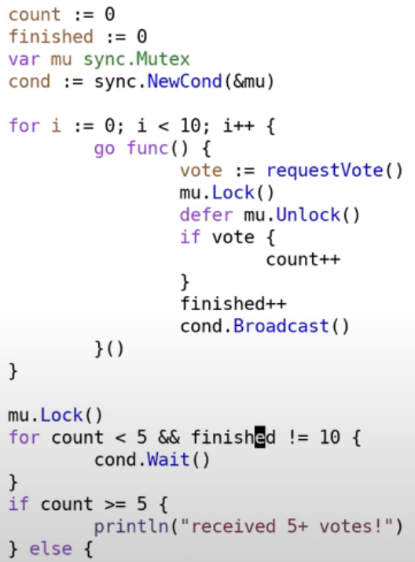
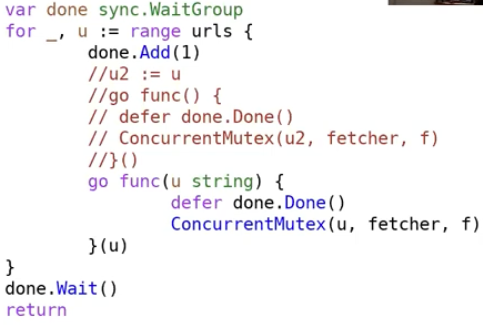
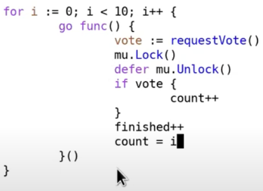
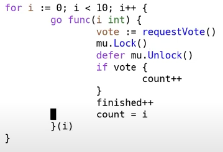
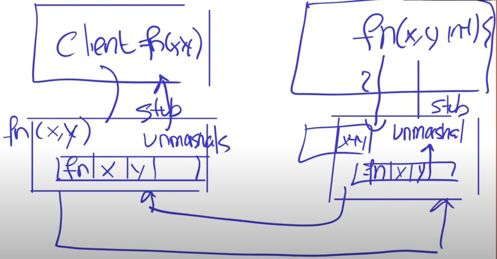

# Memo

## 並行プログラミング

### Challenges

- Race conditions
  - スレッド間で同じメモリ空間を共有するため、複数のスレッドがアクセスするデータは競合する可能性がある
  - `-race`フラグを使うとGoのコンパイラが競合状態を検出してくれる
  - 対処方法
    - データの共有を避ける
      - Channelを使うことで、メモリの共有をせずに単に値を送ることができるため、競合状態を避けることができる
    - ロックを使う
- Coordination
  - Channelを使う
  - Condition variableを使う
- Deadlock
  - シンプルな例としては、メインスレッドしかないのにChannelを使ってしまうとメインスレッドがブロックされて待機するのでデッドロックが発生する（実際にはGoはこれを検出してpanicする）

### Goでの実装

- Channel
  - メモリを共有する必要がないときにはChannelを使って並列処理を実装する

    ```go
    ch := make(chan int) // チャネルの作成
    ch <- x // 送信者は何らかのgoroutineがxを受信するまで待つ
    y := <- ch //受信者は何らかのgoroutineがyを送信するまで待つ
    ```

  - バッファ付きチャネルを使うことで、送信者が受信者を待たずに値を送ることができる
    - ただし、バッファ付きチャネルはバッファのサイズを超えるとブロックされるため、注意が必要
    - あまり使わない
  - チャネルに値を送信するgoroutineがいくつか実行されている状態で、何らかの条件を満たして受信者がチャネルから値を受信するのを辞めた場合、残されたgoroutineは値を送信できないままブロックされ続ける。メインスレッドが終了すると残されたgoroutineも終了するので問題ないが、メインスレッドが終了しないで動き続ける場合はスレッドがリークしてしまうことになる。
    - チャネルに終了を通知するための値（stopCh boolなど）を送信することで、値を受け取ったgoroutineは終了処理を行うことによってスレッドを終了させることができる

- lock + condition variable
  - ロックは競合状態を避けるために、条件変数はスレッド間で協調するために使う
  - メモリを共有する場合（共有した方が便利な場合）には、ロックと条件変数を使って並列処理を実装する
    - 例えばkvサーバーをメモリ空間上に作成し、key-valueテーブルを複数のスレッドに対して共有したい場合
  - condition variableの例
    - T1はリモートマシンから過半数の票を得たいと考えている。T1は新たにリモートマシンと通信を行うスレッドをリモートマシンと同じ数だけ作成する。票のカウントがインクリメントしていき、最終的に過半数の票を得たかを判断する。
      - 最終的に全ての票の結果が集まるまでforループで待機すると何もしないままCPU時間を消費してしまうため良い実装とは言えない。
      - もう１つの方法としてはループごとに一定時間スリープする方法も考えられるが、スリープ時間を調整する必要があり、スリープ中に票が過半数に達したとしてもすぐには終了できない。
      - そこで条件変数を使うことで、票が過半数に達するまでは待機させ、達したときにメインスレッドを起こすことができる。
        - 条件変数はロックに紐づけることで、`cond.Wait()`が呼ばれた際に紐づけられたロックを解放し、他のスレッドがロックを獲得できるようにする。またWaitから戻ったときには、再度ロックを獲得している状態になっていることが保証される。
        - 条件変数は、`cond.Signal()`や`cond.Broadcast()`を使って、待機中のスレッドを起こすことができる。signalは1つのスレッドを起こし、broadcastは待機中の全てのスレッドを起こす。
      

### Sync.WaitGroup

- 呼び出した複数のgoroutineが終了するのを待つために使う
- goroutine呼び出し前に`Add(1)`で内部的にカウンターをインクリメントして、goroutineの処理が終わる際に`Done()`を呼び出すことで、内部的にカウンターがデクリメントされる。
- `Wait()`を呼び出すことで、カウンターが0になるまでブロックされる。



### その他

下記のように直接変数iを関数内で参照してしまうと、goroutine内でプログラムが実行中の間に、外側のforループでiの値が変更されてしまうと、予期せぬタイミングでiの値が変わってしまうことになる。



そのため、下記のようにiを匿名関数に値渡しすることで、コピーされたiが渡されるため、goroutine内でiの値が変わることはない。



## RPC

RPCは下記のようにクライアントとサーバーはそれぞれ関数呼び出しのインターフェースを持ち、実際の通信はそれぞれのスタブを介してMarshal/Unmarshalを行って通信を行う。Marshalは関数の引数や戻り値をバイト列に変換し、Unmarshalはそのバイト列を関数の引数や戻り値に変換する。RPCはこのように関数呼び出しのようなインターフェースを提供することで、ネットワーク越しの通信を抽象化している。



### 障害時にRPCが取りうるセマンティクス

RPCの障害時のセマンティクスは、リクエストがどのように処理されるかを定義する。主に3つのセマンティクスがある。

- at-least-once
  - もしサーバーが障害で応答できない場合、クライアントは再度リクエストを送信する。
  - メリット：これにより、リクエストが少なくとも1回は処理されることが保証される。
  - デメリット：サーバーが同じリクエストを複数回処理する可能性がある。
- at-most-once
  - もしサーバーが障害で応答できない場合、クライアントは再度リクエストを送信しない。これを実装しているRPCが多い。１回だけリクエストを送信し、エラーまたはタイムアウトが返ってくる。アプリケーション側でリトライや重複処理の対処を行う必要がある。
  - メリット：リクエストが多重に処理されることはない
  - デメリット：リクエストが一度も処理されない可能性がある。
- exactly-once
  - もしサーバーが障害で応答できない場合、クライアントは再度リクエストを送信するが、サーバーは同じリクエストを重複して処理しない。
  - メリット：リクエストが正確に1回だけ処理されることが保証される。
  - デメリット：リクエストの重複を検出するための追加のメカニズムが必要になり、実装が複雑になる。これを実現しているRPCの実装は少ない。

## イベント駆動

従来の並行処理では複数のスレッドを生成して各タスクを独立して処理するが、スレッド生成・切り替え・同期には相当なオーバーヘッドが伴う。特に大量の同時接続を扱うサーバーアプリケーションでは、このコストが性能のボトルネックとなる場合がある。イベント駆動アプローチは、単一スレッド内で複数のアクティビティを明示的にインターリーブ（交互実行）することで、このオーバーヘッドを回避する設計思想である。

イベント駆動システムでは、各アクティビティ（例：個別のクライアントリクエスト）の現在の処理状態を明示的にテーブルやデータ構造として保持する必要がある。システムの中核となる単一のイベントループが継続的に動作し、各アクティビティに対する新しい入力（ソケットからのデータ到着、ファイル読み込み完了、タイマー満了など）を監視する。イベントが発生すると、対応するアクティビティの状態を参照して次のステップを実行し、状態を更新する。この方式により、見かけ上は複数のアクティビティが同時に進行しているような並行性を実現する。Node.jsのイベントループやブラウザのJavaScriptエンジンが典型的な実装例であり、現代的なasync/await構文もこの概念を基盤としている。

イベント駆動アーキテクチャの主要な利点は、I/O待機時間を有効活用した高い並行性の実現と、スレッドオーバーヘッドの完全な排除である。しかし、この手法には重要な制約が存在する。単一スレッドで動作するため、CPU集約的な処理では真の並列実行ができず、マルチコア環境での性能向上は期待できない。また、各アクティビティの状態や進行管理をすべて明示的に記述する必要があるため、従来の同期的なプログラミングモデルと比較して実装・デバッグが困難になる傾向がある。特に複雑な制御フローを持つアプリケーションでは、状態遷移の管理が煩雑になり、コールバック地獄のような問題も発生しうる。このため、イベント駆動モデルはI/O集約的なアプリケーション（Webサーバー、チャットシステムなど）では威力を発揮するが、CPU集約的な処理やマルチコア性能を必要とする場面では適さない設計選択である。
