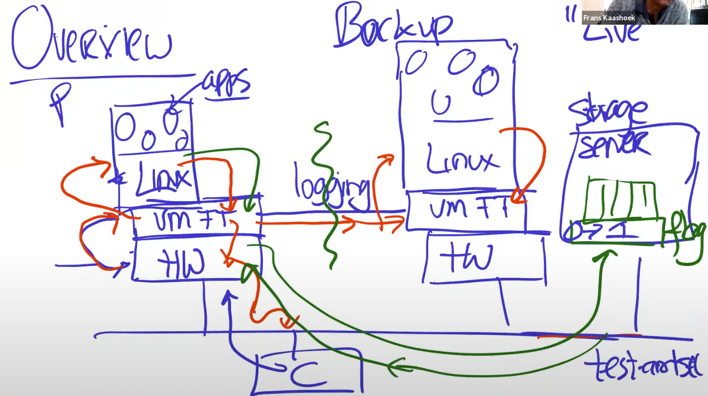

# Memo

## Failures

- Fail-stop failures: failureが起こったらコンピュータは停止する。このコースでは主にこれを扱う
- Logic bugs, Configuration errors, Malicious errors: このコースではこれらが起こることを想定しない

## Challenges

- プライマリがfailしたかどうか（単にネットワークエラーなだけでプライマリは生きているかもしれない）
  - Split-brain system
- どのようにプライマリとバックアップを同期させ続けるか
  - 同じ順番で変更を適用する
  - 非決定論的な操作を避ける
- フェイルオーバー
  - プライマリがダウンした場合にバックアップが引き継ぐ

## 2 main approaches

- State transfer
  - これをPrimary backupと呼ぶこともあるらしい
  - プライマリが状態を変更したら、状態のチェックポイントを作り、バックアップに送信する
- Replicate state machine (RSM)
  - State Machine Replication (SMR)とも呼ぶ
  - 状態の変更を送るのではなく、実行した操作を送り、バックアップも同じ操作を実行する
  - 状態の変更はサイズが大きくなると送信コストが高いため、このコースで扱う多くのシステムはこのアプローチを用いている
    - ex. VM FT, GFS
    - 非決定論的な操作は許可されず、全ての操作は決定論的である
  - ハイブリッドアプローチもよく用いられる。たとえば通常はRSMだが、新たにバックアップを作成する際はState transferを用いるなど

## VM FT

### Level of applications to replicate

- Application level operations (file append/write)
  - アプリケーションの変更が必要
  - ex. GFS
  - 一般的にはアプリケーションレベルで行う方がより高いパフォーマンスを得られる
- Machine level
  - アプリケーションの変更が不要
  - ex. VM FT
    - 従来のハードウェアレプリケーションは高価な専用マシンを使う必要があったが、VMを用いるため、汎用マシンで実現できる
    - RSMに適した設計。VM FTは割り込みをコントロールできる
      - 物理マシンの割り込み（タイマ割り込みなど）はLinuxに届く前にハイパーバイザーのVM FTを経由するため、このような外部のイベントは全てVM FTで事前にキャッチできる
    - 等価的なレプリケーション
      - クライアントにはサーバーは１つのマシンに見える
    - 実際のVMwareのプロダクトである

### Split-brainを防ぐ方法

共有ストレージサーバー上にフラグを置いておく。ネットワーク障害などでプライマリとバックアップの両方が生きていてストレージにアクセス可能なのにも関わらず、お互いに疎通ができない場合は、相手が死んだと考えて、どちらも共有サーバー上に置いてあるフラグを0から1に変更しようとする。変更をする際はtest-and-setを行い、フラグが0の時のみ変更でき、すでに1になっている場合は変更できない。変更に成功した方がプライマリとなる。失敗した方は自殺する（自身を終了させる）。プライマリとなったサーバーは新たなバックアップを作成し、バックアップの同期が完了したら、ストレージ上のフラグを0に戻す。

### 決定論的リプレイの実現

プライマリとバックアップは決定論的ステートマシンとみなすことができるため、プライマリは入力と実行に関連するすべての非決定性をログエントリのストリームとしてログファイルに記録し、ログチャネルを通じてバックアップに送信する（ちなみにログチャネルの通信にはUDPが使用される）。バックアップはログエントリをリアルタイムでリプレイするため、プライマリVMとまったく同じ動作をする。入力と非決定的性のみを送信すれば出力は同じになるはずなので、決定的な操作については送信する必要はない。

時刻やプロセッサのクロックサイクルカウンターの読み取りのような非決定的操作については、その操作がプライマリVMで実行された際に発生した同じ状態変化と出力をバックアップVMで再現するのに十分な情報がログに記録される。仮想割り込みやタイマー割り込み、I/O完了割り込みのような非決定的イベントについては、そのイベントがプライマリVMで発生した正確な命令箇所も記録され、バックアップVMは記録された命令ストリームと同じ地点でそのイベントを実行してリプレイする。バックアップVMはこのような非決定的操作やイベントをリプレイするのに必要な情報を取得できていない場合は、リプレイできないので待機することになる。

たとえば1+1という操作を行うという入力を受け取った場合、この操作は決定論的であるため、プライマリとバックアップは2という同じ結果を得ることができる。しかし、プライマリの処理の途中でタイマ割り込みが発生すると、同様に同じ地点でバックアップもタイマ割り込みを受ける必要があるが、この割り込み自体は非決定的であるため、プライマリはタイマ割り込みが発生した地点をログに記録してバックアップに送信しないと、バックアップは決定論的にプライマリと同じ動作をすることができない。

### 出力ルール

たとえばプライマリが10をインクリメントして11にする操作を実行し、クライアントに11を返す操作を行うとする。もしプライマリがインクリメントを行い、その操作をバックアップにログチャネルを通じて送信したが、実際にはバックアップには届かず、プライマリはそのままクライアントに11を返した後にクラッシュしたとする。この場合、バックアップがフェイルオーバーしてプライマリとなるが、10をインクリメントする操作のログを知らないため、再度クライアントが値の取得リクエストを送ると10が返ってきてしまう。

これを避けるために出力ルールというものが定義されている。プライマリは出力を行う前に、バックアップに対してログを送信し、その確認応答を待ってから出力を行うようにする。これにより確実にバックアップがログを受け取ってから出力を行うことを保証できる。確認応答を行う前にクラッシュした場合はプライマリとなったバックアップは10をインクリメントする操作を知らないが、何も出力されていないため、単にその操作がなかったことになる。確認応答を受け取ってからクラッシュをした場合は、プライマリとなったバックアップはログを受け取っているため、たとえ前のクライアントが11を出力していたとしても、同様にクライアントからのリクエストに対して11を返すことができる。

すでにプライマリが出力した後にバックアップが引き継いだ場合は、新しくプライマリとなったバックアップは再度クライアントに重複するリクエストを返すことになるが、TCPのシーケンス番号が同じであるため、クライアントは重複したリクエストを受け取ったことを認識できる。（ちなみにバックアップが行う出力はVM FTによって破棄されるため、通常は重複することはない。あくまでバックアップがプライマリになったことにより、出力が破棄されなくなるので起こる問題である）
