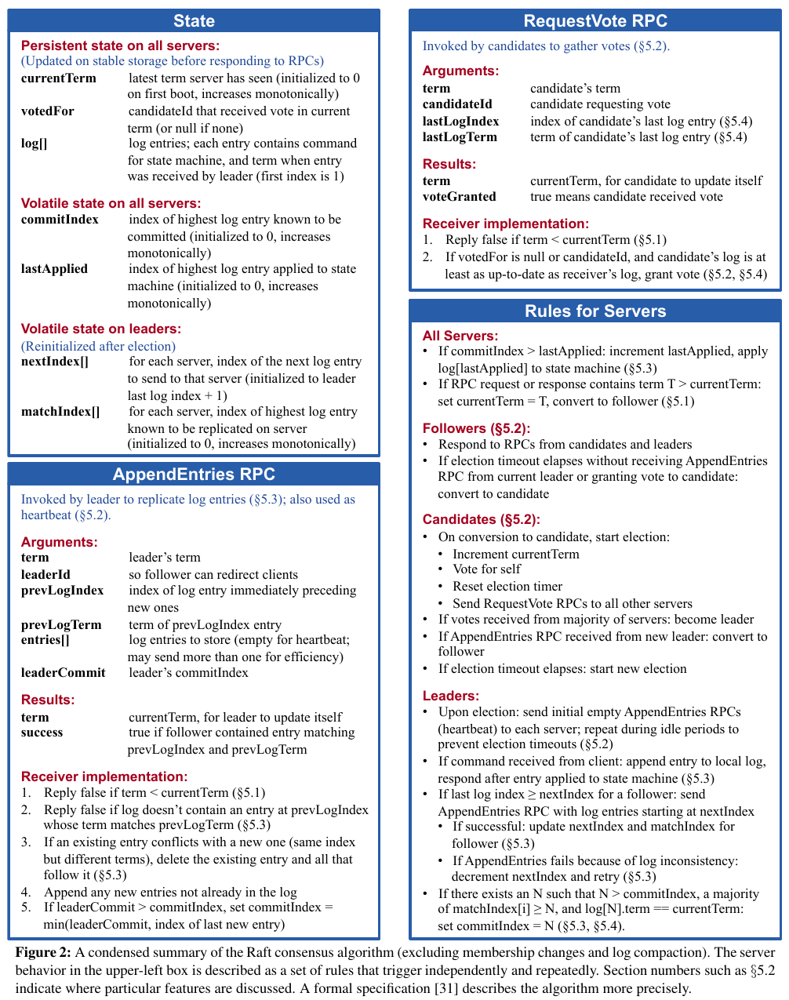

# Memo

## Raftのアーキテクチャ

1. サーバーのコンセンサスモジュールは、クライアントからのコマンドを受信し、それを自身のログに追加する
2. コンセンサスモジュールは他のサーバーのコンセンサスモジュールと通信し、一部のサーバーに障害が発生した場合でも、すべてのログに最終的に同じリクエストが同じ順序で含まれるようにする
3. コマンドが適切に複製されてコミットされると、各サーバーのローカルステートマシン（KVSなど）がログの順序に従ってコマンドを処理
4. 出力がクライアントに返される

## 基本的なRaftの流れ

- 標準的なサーバー数は5台で、これによりシステムは2つの障害を許容できる。
- 各サーバーは、常にリーダー（１台）、フォロワー、候補のいずれかの状態になる。
- フォロワーはリクエストを発行せず、リーダーおよびリーダー候補からのリクエストに応答するのみ。
- リーダーはすべてのクライアントリクエストを処理する（クライアントがフォロワーに接続すると、フォロワーはそれをリーダーにリダイレクトする）。

## Raftアルゴリズムのサマリー

## Raftで用いられるRPC

基本的に下記の２つ（または３つ）のRPCしかない。

- RequestVote RPC：は選挙中に候補者によって開始される。
- AppendEntries RPC：リーダーによって開始され、ログエントリを複製し、ハートビート情報を提供する。
- InstallSnapshot RPC：スナップショットを送る。非常に遅かったり新たに参加するフォロワーに対して、リーダーがすでに破棄したログを送る必要がある場合に、スナップショットを送ることで最新の状態を複製する。

フォロワーがクラッシュするなどしてRPCに対してのレスポンスを得られない場合は、リーダーは無期限に再施行を繰り返す。 
また通常はパフォーマンスのためにサーバーはRPCを並列に発行する。

リーダーはコミット済みエントリの最大のインデックスを記録し、そのインデックスを含めたAppendEntries RPCを他のサーバーに送る。フォロワーはログエントリがリーダーによってコミットされたことを知ると、そのエントリをログの順序どおりにローカルステートマシンに適用する。

クライアントから頻繁にリクエストを受け取る場合、リーダーはハートビートを兼ねたAppendEntries RPCを送信することになる。しかし、クライアントから一定期間リクエストがない場合は、リーダーは選挙タイムアウトを防ぐために定期的にログエントリが空のハートビート用のAppendEntries RPCを送信する必要がある。

リーダーがフォロワーにあるエントリを含むAppendEntries RPCを送った際に、そのフォロワーがそのエントリよりも前のエントリを複製していなかった場合は、そのRPCは失敗し、次にリーダーはそのフォロワーが持つエントリの次のエントリを含むAppendEntries RPCを送る。これにより、フォロワーはリーダーのログと同期することができる。

## Raftのログ構造

ログはログエントリから構成され、各エントリにはインデックス番号がついており、エントリにはコマンドとターム番号が含まれる。

## Raftが保証する特性（Property）

- Election Safety；１つのタームで選ばれるリーダーは１つだけ
- Leader Append-Only：リーダーは自身のログを上書きしたり消去しない。単に新しいエントリを追加するのみ
- Log Matching：同じインデックスで同じタームのエントリはすべてのサーバーで一致する（つまり同じコマンドを持つ）
- Leader Completeness：ログエントリがコミットされたら、以降のタームのリーダーは必ずそのエントリを持つ
- State Machine Safety：サーバーがローカルステートマシンにコマンドを適用したら、他のサーバーも同じインデックスにおいて同じコマンドを適用する

## Raftの選挙

選挙に投票する際は、候補者が自分自身に投票をする場合も含めて、投票後にサーバーがクラッシュし、再起動した場合に、再度投票しないようにするために、誰に投票したのかを永続ストレージに記録する必要がある。

また下記のように低いターム番号の候補者であっても過半数の票を得た場合はリーダーになって、より高いタームのエントリを上書きする可能性がある。エントリ7についてはコミットされていないので上書きされても問題ない。

下記の状態遷移図ではより高いタームのサーバーを見つけたときにリーダーがフォロワーに戻ると書いており、これによって授業内でも混乱が起きていたが、別にリーダーが高いタームを持つフォロワーを見たところでフォロワーに戻るわけではなく、より高いタームを持つ他のリーダーを見つけた場合にフォロワーに戻るという話である。そもそもより高いタームのエントリを持つフォロワーがいたとしても、そのエントリはコミットされていない（過半数に複製されていたら現在のリーダーが選ばれるわけない）ので、上書きしても問題ない。

## Raftの安全性

Raftでは、リーダーに選出されるサーバーに制約を設けることで、あるタームのリーダーには以前のタームでコミットされたすべてのエントリが含まれることを保証する。

### 選挙の制約

Raftでは、以前のタームまでにコミットされたすべてのエントリが新しいリーダーが選出された瞬間からそのリーダー上に存在することを保証する（この特性をLearder Completeness Propertyと呼ぶ）ため、リーダー選出後にこれまでにコミットされたエントリをリーダーに転送する必要がない。つまり、ログエントリはリーダーからフォロワーへの一方向にのみ流れ、リーダーはログ内の既存のエントリを上書きしない。

これを実現するために、Raftではすべてのコミットエントリがログに含まれていない限り、候補者が選挙に勝利できないようにする。具体的には、候補者がRequestVote RPCを他のサーバーに送信した際に、投票者は自身のログが候補者のログよりも最新である場合は投票を拒否する。最後のエントリのタームがより新しいか、タームが同じならよりインデックスの大きいログが新しいと判断される。候補者が選出されるには過半数から票を得る必要があるため、必然的に過半数のサーバーと同じかより新しいエントリを持つサーバーがリーダーに選出されることになる。

### 過去のタームのエントリのコミット

Q：下記のように過去のタームのエントリを過半数のサーバーに複製した場合にコミットしたとみなして良いのか。

1. サーバーA~Eがあり、全てのサーバーがログエントリ1を持ち、サーバーAがリーダー
2. サーバーAがログエントリ2を追加し、サーバーBに複製
3. サーバーAがクラッシュ（エントリ2は過半数に複製できていないので未コミット状態）
4. サーバーEがリーダーに選出（C, D, Eから票を得る。A, Bはより新しいエントリ２を持っているので拒否）
5. サーバーEが自身のログにエントリ3を追加して、直後にクラッシュ
6. サーバーAがリーダに選出（E以外から票を得る。Eはより新しいエントリ3を持っているので拒否）
7. サーバーAは引き続きエントリ2をサーバーCに複製（この時点でエントリ2を過半数に複製したことになるがコミットしたとみなせるのか？）

A：この場合、単に過半数に複製したからといってコミットしたとみなすことはできない。たとえば下記のようにその後にエントリ2が消える可能性がある。

1. サーバーAがクラッシュ（エントリ2は過半数に複製済み）
2. サーバーEがリーダーに選出（エントリ3は2よりも新しいので他の全てのサーバーから票を得ることが可能）
3. サーバーEのエントリ3によってエントリ2が上書きされる

Raftの対策：この問題を防ぐため、Raftでは過去のエントリをコミットするには、現在のタームで追加したログエントリを過半数に複製してコミットすることで、間接的に過去のエントリをコミットするという方法をとる。上記の図の(e)のように、サーバーAがエントリ2を過半数に複製した後に、次に現在のタームで新たにエントリ4を追加して、それを過半数に複製すると、その直後にサーバーAがクラッシュしたとしても、過半数のサーバーが最新のエントリ4を持っていて、サーバーEはそれよりも古いエントリ3を持っているのでリーダーには選出されない。そのため、サーバーAがエントリ4を過半数に複製してコミットした時点で、エントリ2もコミットされたとみなすことができる。

現在のタームのエントリのコミット: ちなみに現在のタームのエントリについては、過半数に複製された時点でコミットされたとみなせる。なぜなら前述したようにその後にリーダーがクラッシュしたとしても、過半数のサーバーは最新のエントリを持っているので、古いエントリを持つサーバーはリーダーには選出されず、必ず最新のエントリを持つサーバーがリーダーに選出されるからである。

## ログコンパクション

ログコンパクションには、スナップショットとログの段階的な圧縮という２つの方法がある。スナップショットでは、現在のシステム状態全体が安定したストレージ上のスナップショットに書き込まれ、その時点までのログ全体が破棄される。スナップショットはChubbyとZooKeeperで使用されている。

Raftでは各サーバーが独立してスナップショットを作成し、コミットされたエントリのみをカバーする。またスナップショットには下記のメタデータも含まれる。「last included indexとlast included termはスナップショット後の最初のログエントリのAppendEntries整合性チェックを行うために使用される。latest configurationはクラスタメンバーシップの変更を行う際に使用される。

- last included index：スナップショットが置き換えるログの最後のエントリ（状態マシンが最後に適用したエントリ）のインデックス
- last included term：last included indexのエントリのターム
- latest configuration：last included index時点のログの最新構成

各サーバーが個別にスナップショットを作成するため、フォロワーがリーダーの許可なくスナップショットを取得できることになるが、スナップショットはすでに合意が取れているコミットされたエントリのみをカバーするため、矛盾した決定は発生しない。仮にリーダーのみがスナップショットを作成するアプローチをとる場合、フォロワーにスナップショットを送信するため、ネットワーク帯域が消費されて処理に時間がかかるのと、リーダーの実装が複雑になる。フォロワーはすでにスナップショットを作成するために必要な情報を持っているため、それぞれが独自にスナップショットを作成する方が安価である。

スナップショットの方法をとる場合、パフォーマンス上考慮すべき点が２つある。１つはスナップショットを作成する頻度（タイミング）であり、もう１つはスナップショットの書き込み処理が通常の処理のオアフォーマンスを悪化させる可能性があることである。１つ目については、ログが一定バイトサイズに達した時にスナップショットを作成すれば良い。２つ目については、コピーオンライトを用いることである。コピーオンライトとは、データのコピーをすぐに実行するのではなく、書き込みが発生した際に該当のデータのみを逐次コピーする方法である。RaftではLinuxのforkのようなOSのコピーオンライトサポートを利用して、ステートマシン全体のメモリ内スナップショットを作成する方法を採用している。

## RaftのLinearizability

Raftの目標は、線形化可能（Linearizable）なセマンティクス（各操作が呼び出しから応答までのある時点で瞬時に正確に一度だけ実行されるように見える）を実装することである。

Raftでは同じコマンドが複数回実行される可能性がある（たとえばリーダーがログエントリをコミットした後にクライアントに応答する前にクラッシュした場合、クライアントはタイムアウト後に再試行する）。対策として、クライアントがすべてのコマンドに一意のシリアル番号を割り当て、すでに実行されたコマンドのシリアル番号を受信した場合はリクエストを再実行せずにすぐに応答する。

また読み取りリクエストに対してリーダーが応答する際に、そのリーダーが認識していない新しいリーダーが存在している可能性があるため、古いデータが返されるリスクがある。線形化可能な読み取りは古いデータを返してはいけないため、Raftでは２つの予防措置をとる。１つ目は、Leader Completeness Propertyによってリーダーはすべてのコミット済みエントリを保持していることが保証されるが、ターム開始時にはどのエントリがコミットされているかを把握していない可能性があるため、ターム開始時にリーダーが空のno-opエントリをログにコミットすることでこれに対応する。２つ目は、リーダーは読み取りリクエストに応答する前に新しいリーダーが存在しているかを確認する必要があり、これにはリーダーが過半数とハートビートメッセージを交換することで対応する。あるいはリーダーはハードビートの仕組みを用いて、リースを発行する方法も取れるが、これは安全性のために制限されたクロックスキューを前提としていて、タイミングに依存する。

## Raftのスケーラビリティ

１つのRaftクラスタには１つのリーダーしかいないので、大量のクライアントのリクエストを処理するのは難しい。そのため、シャードごとにRaftクラスタを作り、それぞれのシャードに対して１つのリーダーを持つことでスケールさせることが可能である。

## メモ

リーダーがコミットするのは１ラウンド、フォロワーがコミットするのは２ラウンド（リーダーは過半数からyesが返ってきたらコミットできるが、フォロワーは次のappendentry rpcでここまでコミットしたというcommitindexをもとにコミットするかを判断するので）

3つのサーバーがいて、フォロワーの１つは死んでいるとする。リーダーはAppendEntryを送って１つのフォロワーからyesが返ってきて過半数を取れたのでコミットしたとみなしてローカルステートマシンに実行させて結果をクライアントに返した後にクラッシュしたとする。そして生きているフォロワーが新たにリーダーになり、クライアントからさっきの値の読み取りリクエストが来たとする。この場合、新しいリーダーは古い値を返してしまうとLinearizable違反になってしまうので、RaftではReadの際も応答する前に過半数とハートビートを交わす必要があり、今回は過半数を取れないのでクライアントには応答しないから、線形可能性違反にはならない。
